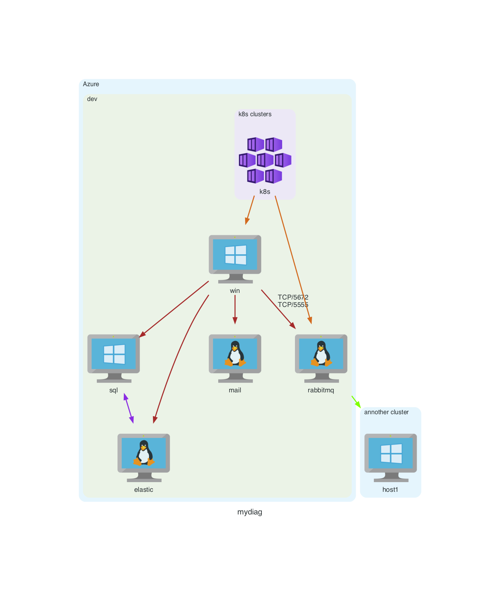

## Diagram generator
define your diagram using yaml syntax

## usage
Make a file named "inventory.yml" with your desired diagram nodes.  
Used python Diagrams lib

> nodes can be found here  
> https://diagrams.mingrammer.com/docs/nodes/aws

#### example
```yaml
diagram_name: "mydiag" # required, name of the diagram
cluster1: # cluster of nodes
  vm1: # cluster member
    - diagrams.azure.compute.VMLinux # first list entry always specify node icon shape
    # all following list items specify connection points to other nodes/cluster
    - ["myfunc"] # list entry specify connection to node parent cluster
    - k8s1 # string specifies connection to another node

cluster2:
  vm2:
    - diagrams.azure.compute.VMWindows
    - k8s1

cluster3:
  my k8s: # subclusters are also supported
    k8s1:
      - diagrams.gcp.compute.GKEOnPrem


cluster4:
  myfunc:
    - diagrams.gcp.compute.Functions
    - k8s1

```
image of diagram is saved in current dir as "diagram_name".png
